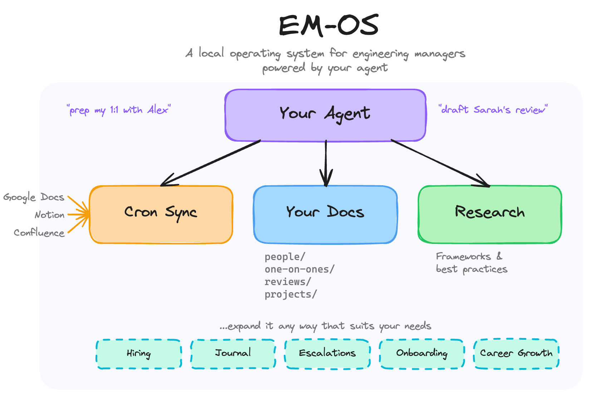

# EM-OS

A markdown-based operating system for engineering managers, built and maintained by your agent.

## What is this?

EM-OS is a prompt that turns any AI agent into a personal system for managing your work as an engineering manager. Point your agent at this repo (or copy-paste the prompt), open it in an empty directory, and it walks you through setup. After that, just talk naturally: "prep me for my 1:1 with Alex", "let's start Sarah's review", "I need to escalate something."

The key idea: **you don't maintain the system, the agent does.** You talk, debrief, ask questions, and think out loud. The agent organizes everything into interlinked markdown files that compound over time. Your 1:1 history feeds into review drafts. Open action items surface when you prep for meetings. A book quote you saved months ago gets pulled up when you're preparing for a difficult conversation. The system gets more useful the more you use it.

Inspired by the [LLM Wiki pattern](https://gist.github.com/karpathy/442a6bf555914893e9891c11519de94f) by Andrej Karpathy. Instead of re-deriving context from scratch every conversation, the agent incrementally builds a persistent, interlinked wiki that compounds over time.

## How to use it

### Option 1: Point your agent at this repo

If your agent supports project context (Claude Code, Codex, Cursor, etc.), clone this repo or point it at `prompt.md` as context. Then open a conversation in an empty directory where you want your system to live.

### Option 2: Copy-paste the prompt

Open [`prompt.md`](prompt.md), copy its contents, and paste it into any agent conversation. Then tell the agent to set up the system in your current directory.

### First run

The prompt includes an onboarding flow. The agent asks about your team, your role, your products, how you work, and where your data lives. Based on your answers, it creates a tailored directory structure and an `AGENTS.md` file (or `CLAUDE.md` for Claude Code) so future sessions automatically load the system context.

## What it does

The system supports the full range of EM work. You don't need to use all of these. The system adapts to how you actually work.

**People and 1:1s**. Track your direct reports, manager, and key stakeholders. Prep for 1:1s by pulling up history, open action items, and relevant project context. Debrief after 1:1s and the agent files everything, updates people profiles, and tracks commitments.

**Performance reviews**. Draft reviews grounded in months of accumulated 1:1 notes, project outcomes, and documented observations. The agent pulls the evidence; you shape the narrative.

**Research**. Ask about management frameworks, check review drafts for bias, understand technical concepts your team is working with. Useful research gets saved to a personal reference library that grows over time and surfaces in future conversations.

**Hiring**. Track open roles, draft job descriptions, file interview debriefs, summarize candidate pipelines.

**Products and projects**. Track what your team owns, the tech stack, shared dependencies, and active projects with status, decisions, and blockers.

**Escalations**. Turn raw frustration into structured, evidence-based escalation documents.

**Napkin math**. Build vs. buy analysis, initiative sizing, headcount ROI. Back-of-envelope reasoning you can bring to a meeting.

**Career growth**. Development plans for your reports grounded in their goals and the leveling guide. Reflection on your own growth as a manager.

**Communication**. Draft team announcements, project proposals, reorg comms, meeting prep docs.

**Incidents and postmortems**. Structure the aftermath of production incidents, track follow-up actions.

**Difficult conversations**. Sounding board for tricky people situations, grounded in frameworks and documented context.

## How it compounds

The real value isn't any single operation. It's how they connect over time:

- A 1:1 debrief captures that your report led a successful design review and is growing into tech lead responsibilities
- You save a quote from a management book about supporting that transition
- Weeks later, when prepping their next 1:1, the agent surfaces the growth arc and open action items
- When review season comes, the agent drafts a review grounded in months of specific, documented evidence

Every interaction leaves the system a little richer. The agent maintains cross-references, tracks commitments, and surfaces relevant context from past conversations.

## Syncing external data

Your real working docs probably live in Google Docs, Notion, or similar tools. During onboarding, you set up sync sources and a cadence. Each session, the agent checks if it's time to sync and offers to pull in new data using whatever tools are available: CLI tools, MCP servers, or manual paste.

## Eval

The repo includes an eval harness (`eval/`) with test personas, operational scenarios, and a deep multi-session simulation that validates compounding behavior across 16 sessions. See [`eval/README.md`](eval/README.md) for details.

## License

[MIT](LICENSE)
